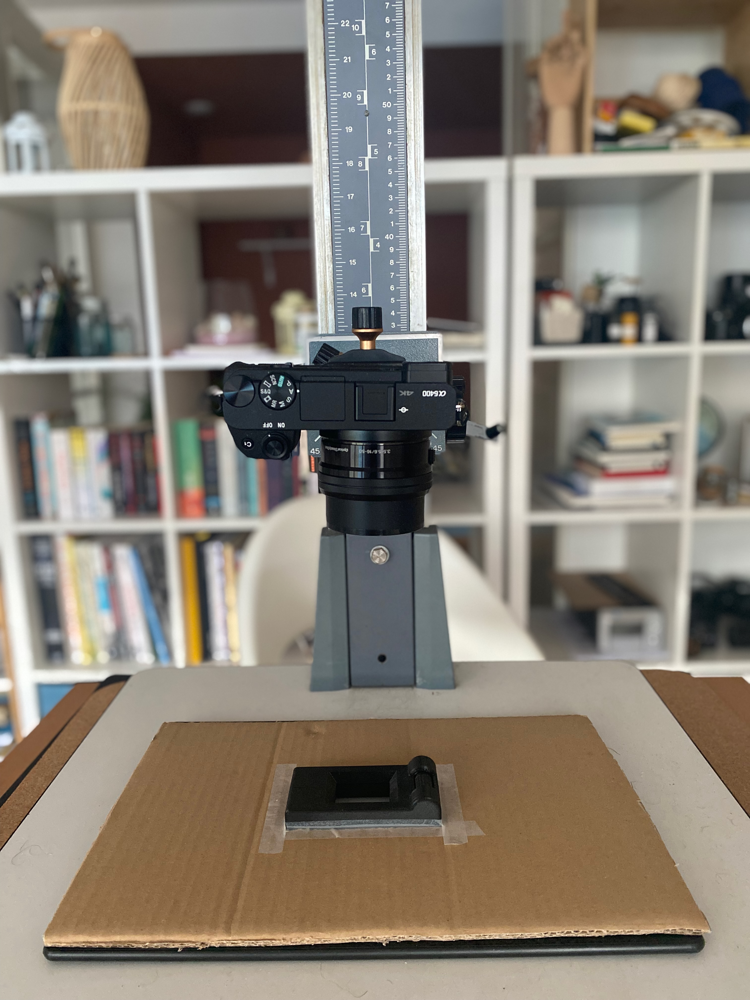
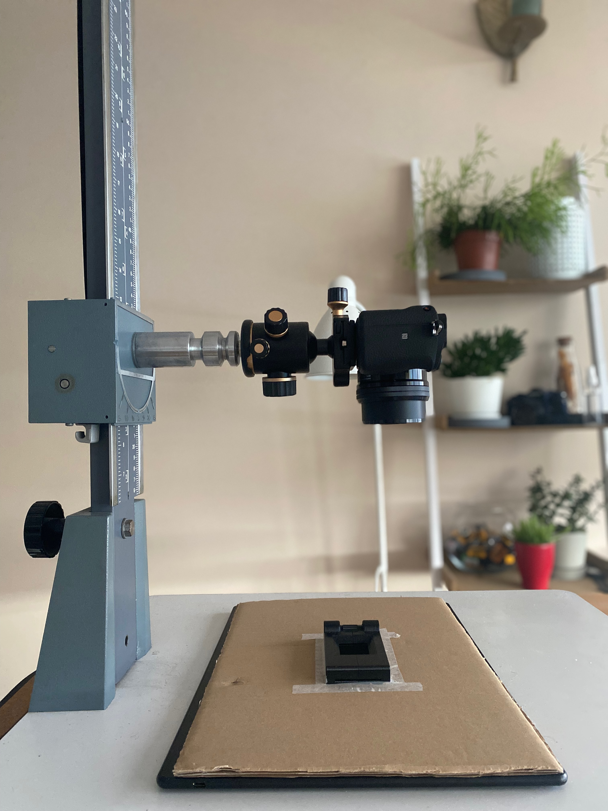
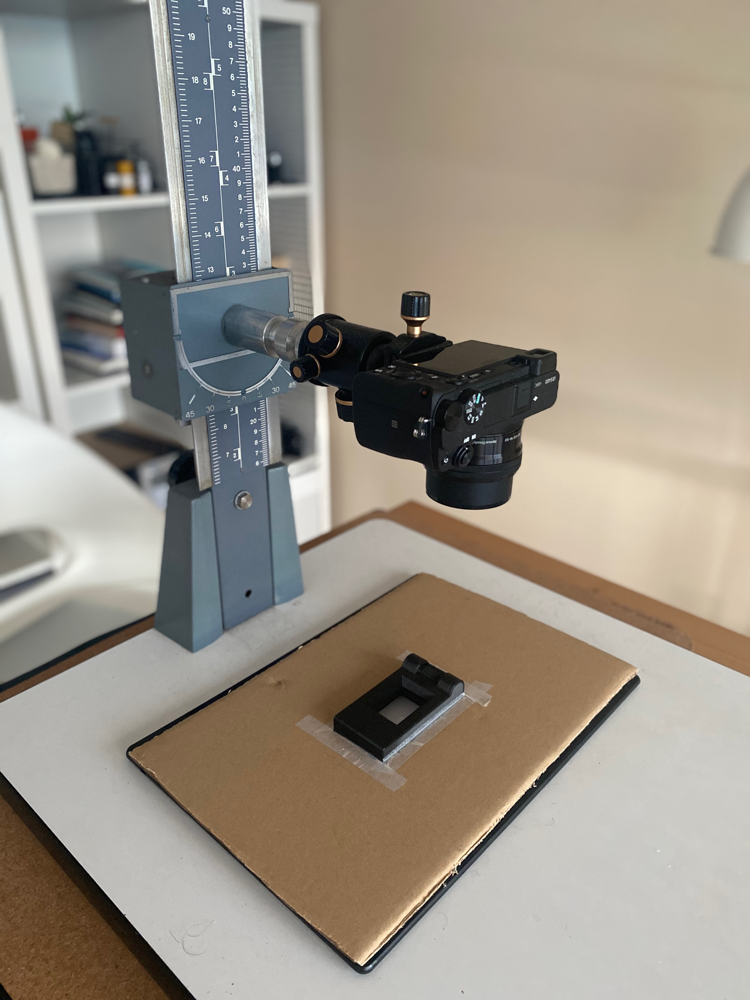
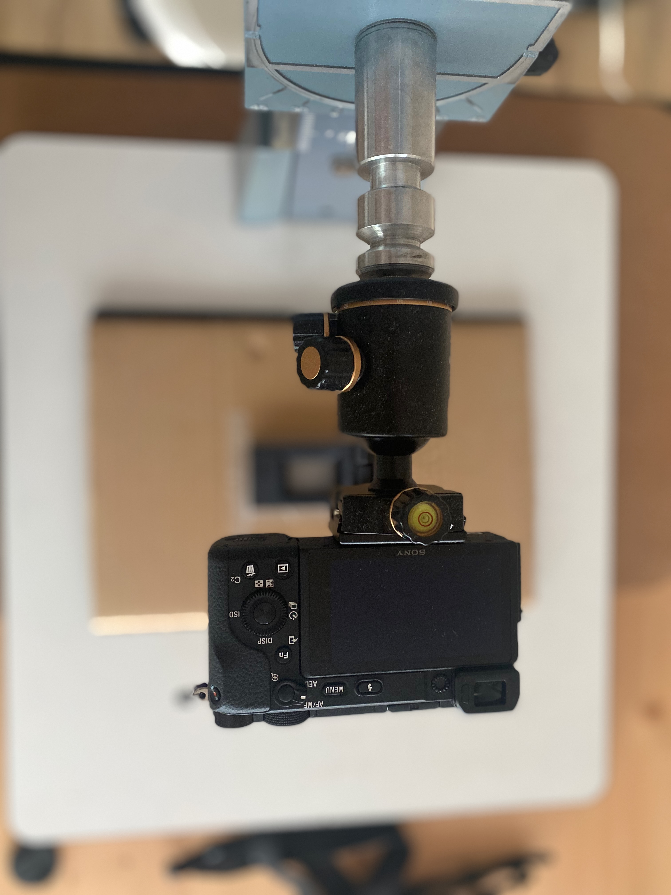

In this day and age, if you are a film shooter, you know that digitalizing film is inevitable. Sure, it's great fun to have a darkroom and play with silver gelatin prints for both color and B&W, but let's face it, we all have Instagram and want to share our work with the rest of the world. If you are lucky enough to have the film scanned at your local lab, great, but prices are [going higher and higher](https://silvergrainclassics.com/en/2021/10/film-prices-analysed/), so to get those images on your device, you need some setup to scan them.

The cheapest one is to buy one of the flatbed scanners, like Epson V600, but for 35mm film, I did not get the results I wanted. Another option is to get a dedicated film scanner from Nikon, Minolta, and others, but people sell them for mental prices and are out of budget for me. So here comes the option of scanning with the digital camera.

A few components of which setup consists are a [**camera**](#camera), a [**lens**](#lens) with macro capability; some [**stand**](#stand) to hold the camera, a [**film holder**](#film_holder), and a [**light source**](https://#light_source). let's break it down each by one

#### Camera

I use cropped sensor mirrorless Sony a6400, but you can use any camera with an interchangeable lens, whether it's DSLR or mirrorless, full-frame, or cropped sensor.

#### Lens

To me, this is the crucial part. Here we have a few options, but it needs to be a macro-capable one. One of the most popular options is to buy Nikkor 55 ⨐2.8 AI-S Micro, which is not very expensive and seems to be a good option, but I already own some enlargers and enlarger lenses. I chose the enlarger lens El-Nikkor ⨐ 2.8, a cheap lens that produces excellent images. The cool thing about the enlarger lenses is that it's built for projecting flat images and as our film is also flat, or at least it should be 🙃, this will be a good fit for us.

To mount an enlarger lens on the camera, we need some adapters. The lens has an M39 Leica mount (as most the enlarger lenses do), and my camera (Sony a6400) has a Sony E-mount bayonet. You might think buying an M39 to Sony E-mount adapter would do the job, but wait for a second; we are not yet there. The lens does not have any mechanism to focus, so you need to physically change the distance to the subject and get closer or far from it to focus on it. An excellent tool for that is called a "focusing helicoid adapter" to make our life easier. You can find it for different mount types. Still, I find the M42-to-M42 version easiest and cheapest to bye. as it is an M42 mount and the lens has M39, I bought an M39 to M42 adapter wing, which is dirt cheap, and instead of M39 to Sony E adapter, I brought M42 to Sony E adapter. This whole information may sound intimidating, but it's not.

> Another cheap option for “easy focusing” and also for macro photography is to buy some kind of so-called 'Bellows,' which I'll explore later

So these are the final lens mount system:

- Lens El-Nikkor f2.8
- M39 to M42 Adapter
- M42 to M42 focusing helicoid adapter
- M42 to Sony E mount adapter

  
   
  
  

#### Stand

When it comes to stand, first what comes to mind is a tripod, which I already own. While it may be somewhat sturdy, legs always get in my way and never really is the comfortable way to use it. Also, we need to hold the camera pointing lens down towards the film, and if you don't already possess a perfect and flexible one, my suggestion would be: don't go that way.

Other than a tripod, copy-stands seemed an excellent and reliable solution, but copy-stands from Kaiser or other brands can get expensive. So I decided to make one 😎. as I already wrote above, I happen to have a Durst enlarger which, with easy conversions, can be used as a copy-stand.

If you choose to buy an enlarger as a copy stand, I recommend Durst M601, which I currently use; it has a 3/8" screw hole, and you can easily mount a tripod ball-head on it.

Another good and more compact alternative is Durst M301 or Durst F30, which sometimes goes cheap on eBay (for 20$).

#### Film holder

If you have tried to search film holders, you are probably familiar with film holders from Valoi, Negative Supply, Essential Film holders, Lomography Digitalize, and others. Some of them look very neat, sturdy, and a reliable solution but are not particularly cheap. You can also make DIY it at home from cardboard. Alternatively, there are some 3D model files out there (you can google it), and if you have a 3D printer, you can print it or find the 3d print-shop online and order. I discovered my 3D-printed one on Etsy for 30€, it can only hold 35mm film, but that's enough for me. It's small and affordable, not super great, but usable, and it does its job. I may invest in the Valoi system in the future; let's see.

#### Light Source

I've searched options for LED light-box to find out which options people are using, and there is a diversity of opinion about it. I just went to my local art supply store and bought a cheap A4 size light-box for tracing paper. You can also use an iPad or iPhone as a light source but try to diffuse it somehow to avoid "screen pixels" appearing on the final image.

> If you accounted newton rings with you light-box, it can be solved by using ARN glass (Anti-Newton).

Tips for the lighting:

1. Shoot with the emulsive (matte) side of the film facing your camera (it's less reflective)
2. Use your lens hood (if you have one)
3. Turn off all ambient lights in the room
4. Have your aperture on your lens set to around f8.0

See more tips about the backlight source: [https://forums.negativelabpro.com/t/suggested-backlight-sources-for-scanning-film-with-dslr/130](https://forums.negativelabpro.com/t/suggested-backlight-sources-for-scanning-film-with-dslr/130)

**TL, DR;**

Here is a picture of my setup; it looks sturdy, feels sturdy, and works great.

Can this be improved? This is a good one, but I can take it further. I already have some ideas to take this scanning setup to the next level using Arduino: to roll the film and automatically take pictures. Also, maybe using an enlarger head as a better-diffused light source in the future, but this scanning setup seems quite enough for me to test the camera scanning experience.

