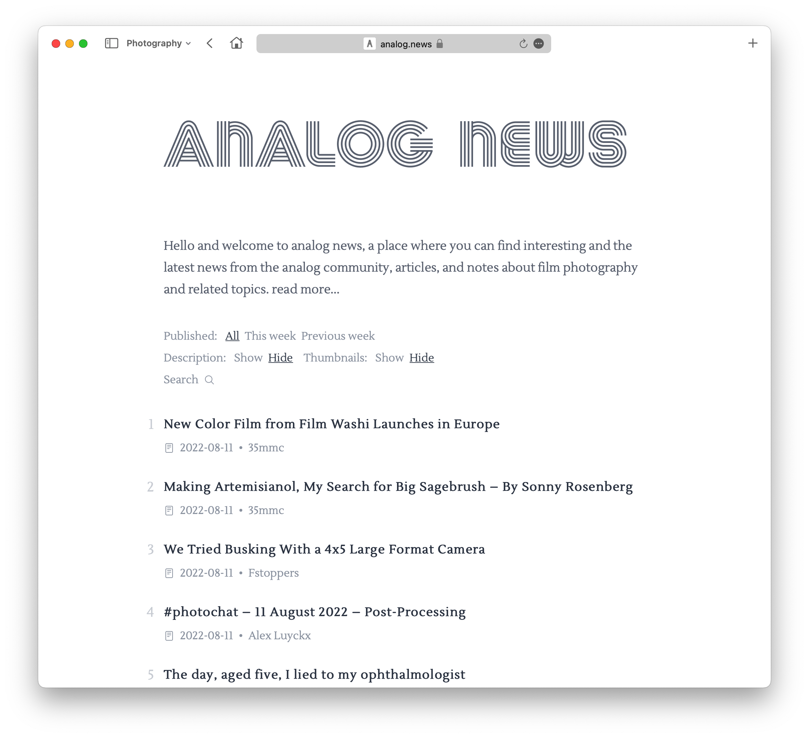

Hello there, film photographers! I recently worked on a project called Analog News that I'd like to share with you, but first I'd like to give you some background on it.

When I try new things, such as art, photography, or whatever, I try to read everything I can about it, dive deep, and learn everything I can; Subscribe to YouTube channels that interest me, join Reddit if one exists, and explore blogs, websites, and articles. Film photography was no different. I subscribed to several YouTube channels, including Nico's Photography Show, T. Hopper, and Art of Photography, and others, and there is only one place to watch them - YouTube. Isn't it simple?

What about blogs, though? There are numerous excellent blogs available, including Analog.cafe, 35mmc, Kosmo Foto, Emulsive, Casual Photophile, and others. Don't get me wrong; I enjoy all of those websites; I visit them on a weekly basis and also subscribe to newsletters, which is a great way to keep up with them. You get a week or month in review and can read it while sipping your coffee. However, being a startuper, entrepreneur, and software developer requires you to subscribe to dozens of newsletters these days, and letters are sometimes 'lost in translation.' Another option is to visit blogs on a regular basis to see what's new; I've never had a good experience with having so many tabs open in a browser. My startup (Stack Browser) shines in this area! I have a dedicated space for film photography blogs, but I wanted more, so I created [analog.news](https://www.analog.news). I was high on weed, sitting at home at 11 p.m., with my MacBook charged - an almost ideal starter kit for experimenting with new things. As I moved from site to site, I noticed that the majority (if not all) of them were built with WordPress. I was aware that WordPress includes RSS feeds by default and quickly created a project to parse those feeds.

First, I wanted to put a web app, presumably a PWA, on my iPhone's home screen to improve my personal reading experience. But after a few hours of coding, I liked the outcome, and bam! Why don't I tell the rest of the world about it? Someone like me might like the idea and put it to use. I looked for a domain name, and luckily, [analog.news](https://www.analog.news) was available and reasonably priced; I purchased it, set it up, and deployed it! The next thing I did was ask each publisher I used if they were okay with it, and I was pleasantly surprised when they all said yes.

For the time being, I'm pleased with the end result. I have a few ideas for improvements and new features to add; let's see where this goes...

