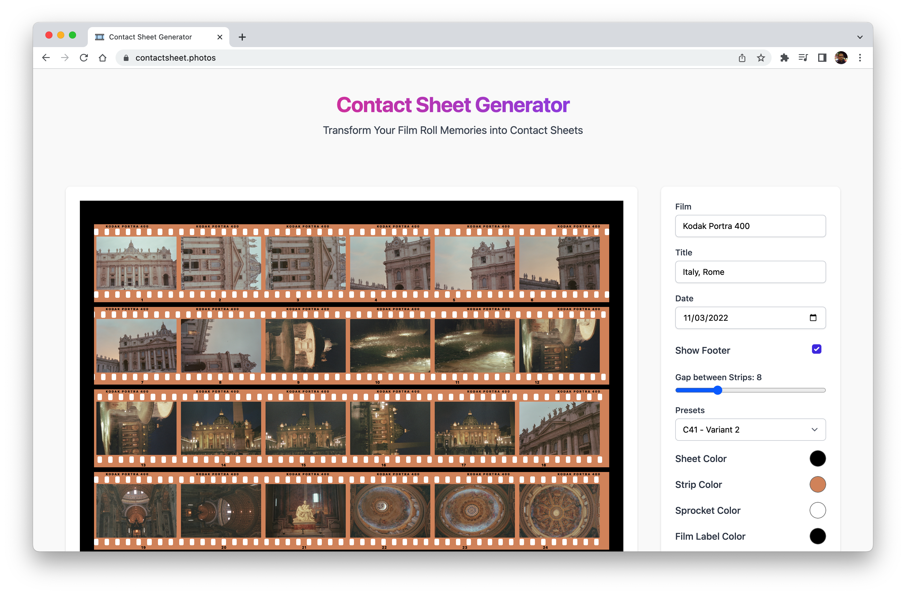

import ContactSheet1 from "./images/contact-sheet-1.png"
import ContactSheet2 from "./images/contact-sheet-2.png"
import ContactSheet3 from "./images/contact-sheet-3.png"
import ContactSheet4 from "./images/contact-sheet-4.png"

import Gallery from "src/components/gallery"

Hi film shooters!

I've been working on a simple tool to generate contact sheets from your film scans.
It's called Contact Sheet Generator and it's available at [contactsheet.photos](https://contactsheet.photos).

There are some predefined styles included to choose from, and you can also customize the layout, the size, the spacing, and the colors.

This is a free web app, and also I wanted to mention that it does not upload your images to any server, never saved anywhere, it's all done in your browser,
so once you close the tab, your images are gone.

In the future, if there is enough interest, I might add some features, and also maybe build a plugin for Lightroom or Capture One. I'm not familiar with programming for those apps, but let's see.

Here is a short video recording of the app in action:

  <iframe width="560" height="315" src="https://www.youtube.com/embed/vOqmo4uHGgU" title="YouTube video player" frameborder="0" allow="accelerometer; autoplay; clipboard-write; encrypted-media; gyroscope; picture-in-picture; web-share" allowfullscreen></iframe>

I hope you find it useful, and if you have any feedback, please let me know!

Cheers!

<Gallery images={[ContactSheet1, ContactSheet2, ContactSheet3, ContactSheet4]} />