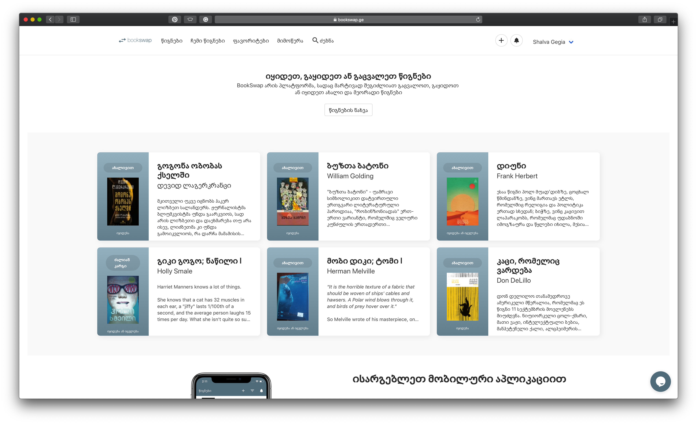

BookSwap is the convenient platform in Georgia for people, who wants to find, swap, sell or buy second-hand books.

Swap/Sell second-hand books is quit actual in Tbilisi (Georgia).

Main idea, why I created BookSwap is that, the only way people could swap second-hand books in Tbilisi (Georgia) was though the Facebook Groups.

I personally tried this types of groups/forums and had a conclusion: even though Facebook group served us well long time and helped interested people connect each other, I had feeling that and I missed some functionality I wanted.

Facebook groups has its disadvantages, for example its impossible to make track of wanted book and get notified if someone sells or wants to swap it.

Its hard to find/search desireable book though the wall of hundreds of posts.

Thats why I created this side project called BookSwap.

View on  [App Store](https://itunes.apple.com/us/app/bookswap-georgia/id1440375612?ls=1&mt=8)
[Play Store](https://play.google.com/store/apps/details?id=com.bookswap.app)