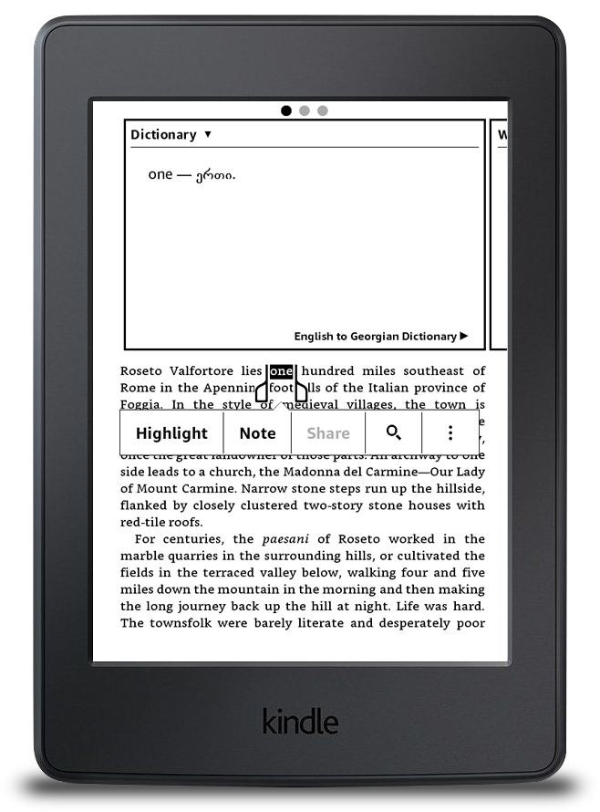

გადავწვყიტე გამეკეთებინა Open Source ინგლისურ-ქართული ლექსიკონი ქინდლის ყველა ვერსიითვის.
ლექსიკონი დახვეწის პროცესშია თუმცა საკმაო სიტყვების რაოდენობა უკვე დაგროვდა.
ლექსიკონის გამოყენება მარტივია: ქინდლში კითხვის დროს მონიშნავთ სიტყვას და გამოვა ფანჯარა სადაც იქნება მნიშნვნელობა ქართულად (ისე როგორც სურათზეა მოცემული)

ნათარგმნი სიტყვების რაოდენობა — 40533

პროექტის source code და ასევე უკვე დაგენერირებული ლექსიკონი დევს Gihub-ზე ( Release-ებში). ამ მეთოდით შეიძლება შეიქმნას ნებისმიერი ლექსიკონი ნებისმიერ ენებს შორის.

სიტყვების სათარგმნად გამოყენებულია Google Translate Api რადგან უფასოა, თუმცა შესაძლებელია თქვენთვის სასურველი ნებისმიერი api-ს გამოყენება.

პროექტის გითჰაბის მისამართი:
English to Georgian Dictionary for Kindle e-Readers

ლექსიკონის მისამართი: Dictionary

ლექსიკონის ქინდლში ჩაწერა/დაყენების ინსტრუქცია წერია პროექტის README.md-ში

View post on Medium
[medium](https://medium.com/@shalva.gegia/%E1%83%94%E1%83%9C%E1%83%92%E1%83%9A%E1%83%98%E1%83%A1%E1%83%A3%E1%83%A0-%E1%83%A5%E1%83%90%E1%83%A0%E1%83%97%E1%83%A3%E1%83%9A%E1%83%98-%E1%83%9A%E1%83%94%E1%83%A5%E1%83%A1%E1%83%98%E1%83%99%E1%83%9D%E1%83%9C%E1%83%9D-%E1%83%A5%E1%83%98%E1%83%9C%E1%83%93%E1%83%9A%E1%83%98%E1%83%A1%E1%83%97%E1%83%95%E1%83%98%E1%83%A1-ac7a57469219).